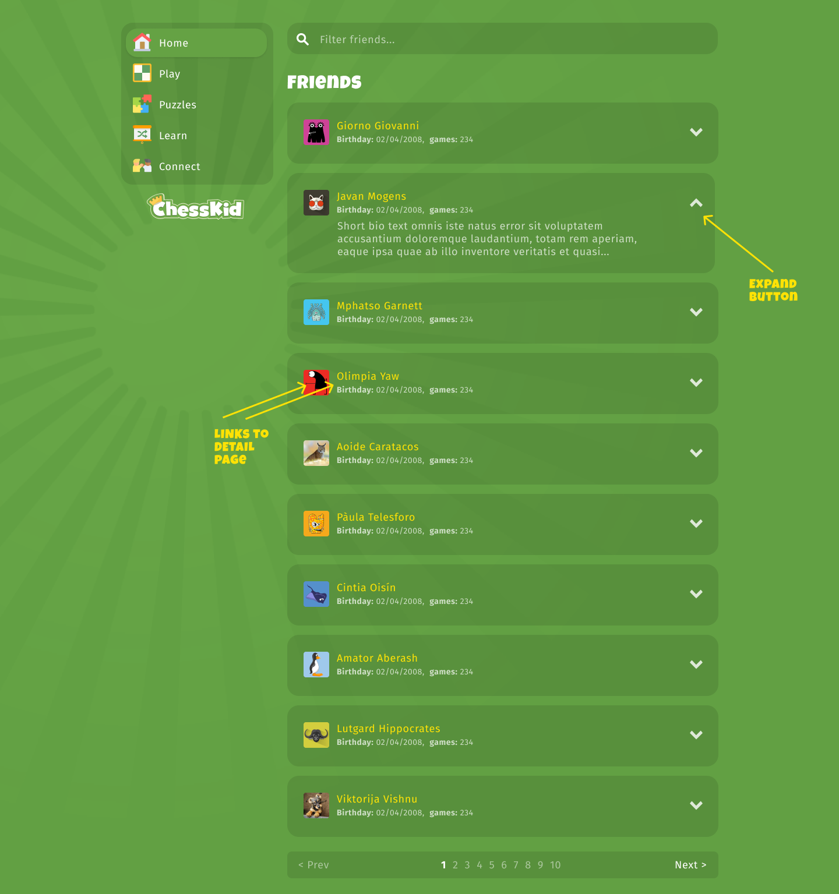
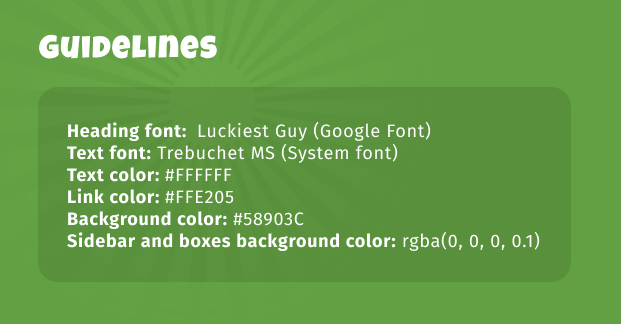

#  Front-end test

## Requirements
- Node.js 12+

## Setting it up
1. Clone this repository
2. In the server folder run `npm i && node index`

This will run the mock server at port 8000 from where you'll consume the API for the test.

## Instructions
You'll create 2 pages and we'll give you the design for the first one, so you should implement it to look the closest as possible and for the other page, you should use your creativity to implement the way you want.

- Create your code inside a `client` folder. We should be able to run your app through `npm run serve`;
- Use Vue 2 or Vue 3;
- Styling frameworks like Bootstrap, Material Design, Vuetify should NOT be used since they won't allow us to properly assess your styling skills. Use SASS for styling;
- It should be a Single Page Application, so whenever the user navigates between pages it should not reload;
- Document your code when appropriate to make it cleaner;
- Use Typescript;
- Add state management to your app.

### Page 1: Home
According to the following images:
|Desktop   | Mobile   |
|---|---|
|   |   |

|Guidelines   |
|---|
|   |

- your layout will be responsive having a single breakpoint of 1024 pixels (mobile and desktop)
- on desktop:
  - the content has a maximum width of 1024 pixels and is centralized
  - the menu is on the left and scrolls together with the rest of the page
- on mobile:
  - the content has a margin of 20 pixels
  - the menu has the same items and goes to the bottom being always visible over the rest of the page
- friends list:
  - the user should be able to filter the list searching for a text included in either first or last name
  - paginate (show 10 items per page)
- friend card:
  - add a link that will navigate to the [Friend details](#page-2-friend-details) page
  - each card is collapsable allowing the user to toggle additional friend's details visibility

## Page 2: Friend details
Create your design here and show all details of the selected friend.
- the URL should be `/friend/:id` where the id is a parameter passed from the Home page
- the user should be allowed to return to the Home page through a link or navigate to the previous or next friend

Bonus:
- make use of effects and CSS animations
- highlight the filter text in the search results
- create a single test using Jest

## Endpoints and assets

You can get all [assets](./assets) directly from the root URL, e.g. "/logo.png".

The only endpoint you'll consume is `/api/get-friends` which returns the following schema:

|Field Name|Type|Description|
|-|-|-|
|id|number|Friend's unique identifier
|firstName|string|First name
|lastName|string|Last name
|email|string|E-mail
|gender|string|Gender
|avatar|string|Avatar URL
|url|string|Random url
|bio|string|Biography
|birthday|number|Birthday in UNIX timestamp
|gamesCount|number|Number of games played
|isAdmin|boolean|Is a system administrator?
